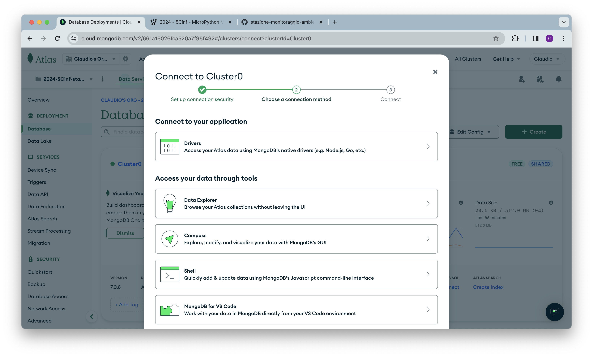
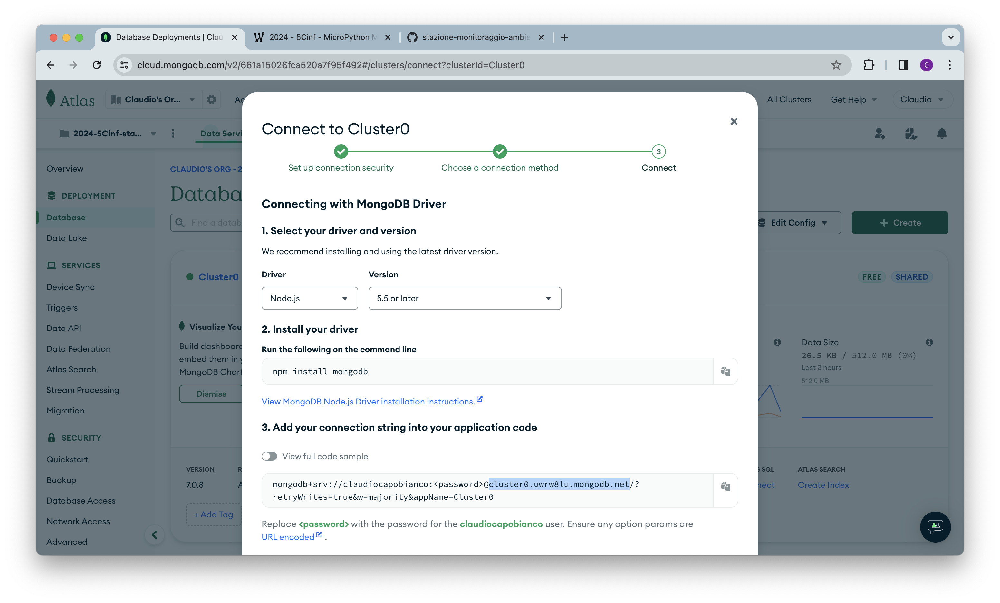
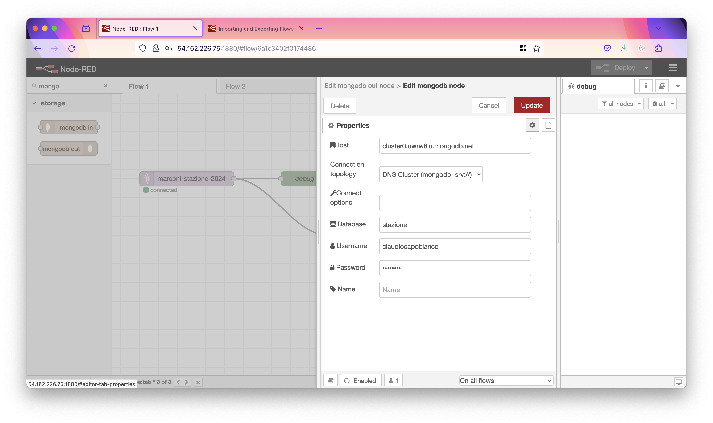
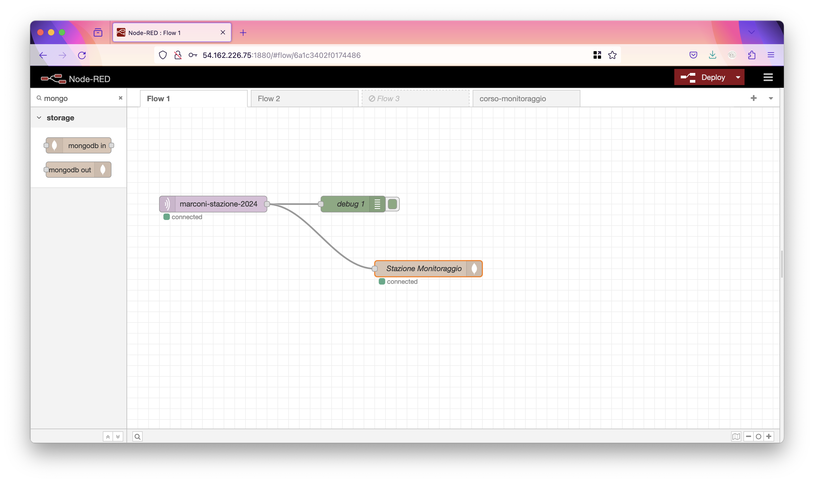
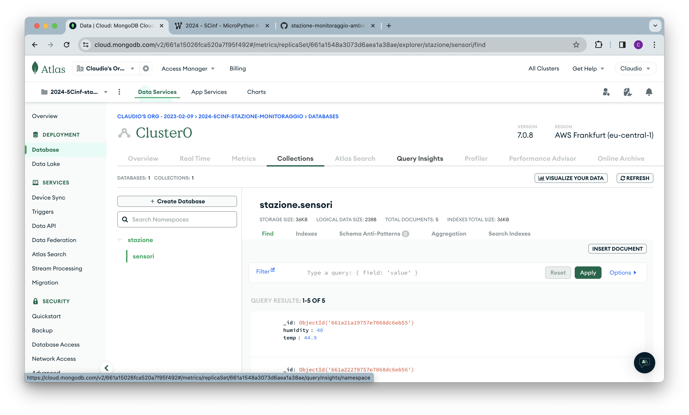

# MongoDB

Come database NoSQL in cloud, useremo [MongoDB](https://www.mongodb.com/).

> MongoDB is a source-available, cross-platform, document-oriented database program. Classified as a NoSQL database product, MongoDB utilizes JSON-like documents with optional schemas. MongoDB is developed by MongoDB Inc. and current versions are licensed under the Server Side Public License.

Fare il login con le credenziali Google della scuola, rispondendo alle domande per fini statistici. 

Creare un nuovo progetto:
- Database M0 (Free)
- Nome progetto: StazioneMonitoraggioAmbientale
- Togliere le spunte "Automate scecurity setup" e "Add sample dataset"
- Cliccare su "Create Deployment"
- In "Add a connection IP address" selezione "Allow Access from Anywhere", quindi "Add IP Address"
- Su "Create a database user": come username usare nomecognome (tutto attaccato, senza punto) e come password mettere Scuola100, quindi premere su "Create database user"
- Andare avanti

Se vi doveste essere persi alcuni dei passaggi prima, potete rimediare anche successivamente
- Per impostare il firewall, nel pannello a sinistra, nella sezione Security, selezionare Network Access
- Cliccare su Add IP Address, quindi "Allow Access from Anywhere" (`0.0.0.0/0`)

## Connessione a Node-RED

Nella pagina "Connect", selezionare "Drivers"

Nella pagina seguente, copiare _solo_ la parte dell'hostname, come in figura.

Tornare su Nodered, aggiungere il nodo "mongodb out", quindi cliccarci sopra per configurarlo e cliccare sulla matita per configurare il server. Impostare come segue:

- Host: incollare l'hostname copiato
- Database: "stazione"
- Username: il vostro username
- Password: la vostra password
- Name: opzionalmente potete mettere un nome al server

Tornati nella pagina precedente, impostate:

- Collection: "sensori"
- Operation: "insert"
- Impostare la flag "Only store msg.payload object"

Connettete il vostro nodo all'input MQTT e la configurazione è finita!

Provate con Wokwi a generare dei dati. Quindi andate su MongoDB Atlas per controllare che sia tutto OK.

Cliccate su Database->Browse Collections e dovreste vedere i vostri dati.

