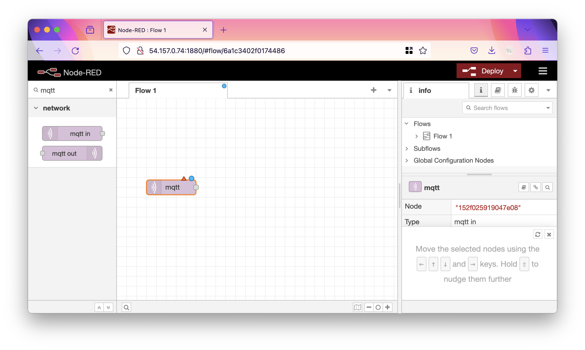
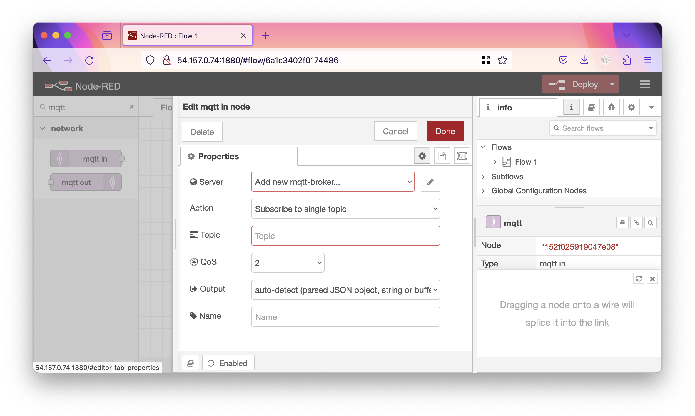
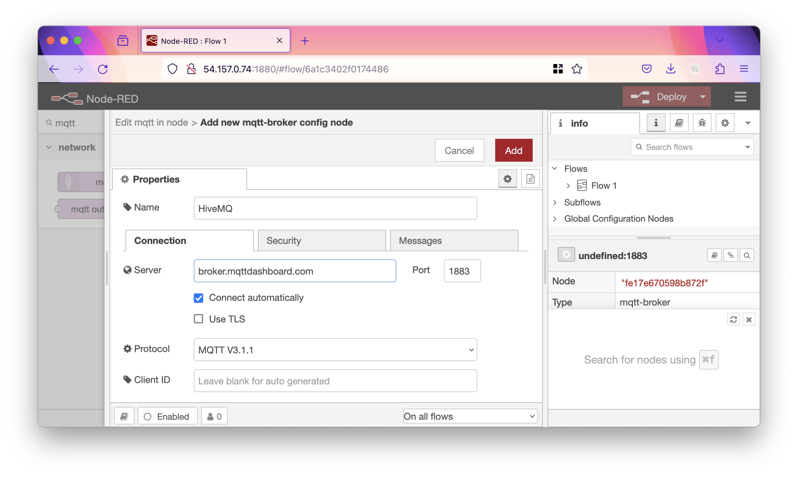
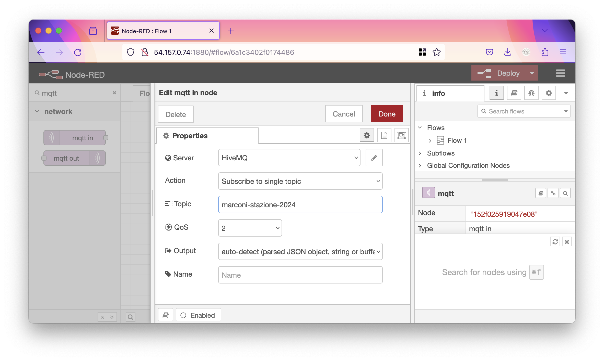
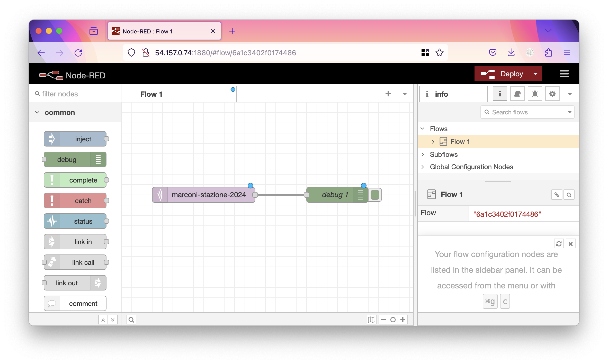
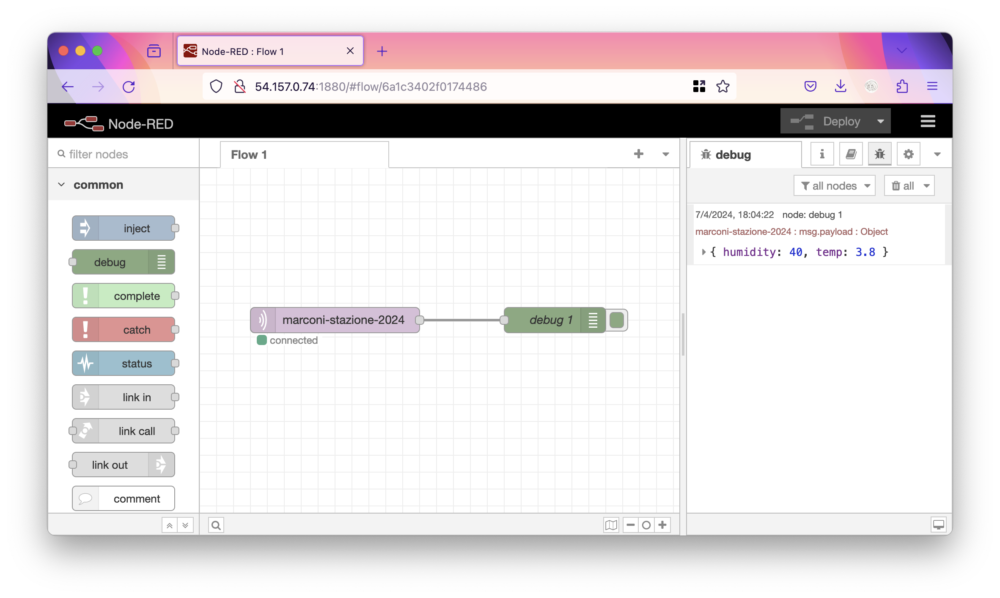

# Installazione Node-RED

Continuando il lavoro fatto nelle scorse settimane, installeremo un'istanza di Node-RED su una macchina EC2 di AWS. Seguiremo [questa](https://nodered.org/docs/getting-started/aws#running-on-elastic-beanstalk-with-high-availability) guida.

Lanciare una macchina EC2 come segue:

- Ubuntu Server
- t2.micro
- aprire le porte 1880, 80 e per utilità anche "All ICMP", come sorgente usate "Any"
- come chiave sempre `vockey.pem`

Installare Node-RED come segue (attenzione, rispetto alla guida siamo passati alla versione 21):

```sh
curl -sL https://deb.nodesource.com/setup_21.x | sudo -E bash -
sudo apt-get install -y nodejs build-essential
sudo npm install -g --unsafe-perm node-red
```

Installare anche i nodi che ci serviranno per MongoDB:

```sh
cd ~/.node-red/
npm install node-red-node-mongodb
```

Infine avviare Node-RED:

```sh
node-red
```

Adesso è possibile accedere alla propria istanza con andando su `http://<your-instance-ip>:1880/`.

## Flow MQTT

Cominciamo a configurare il nostro "flow" di Node-RED.

Cerchiamo nella casella di ricerca in alto a sinistra "MQTT" e trasciniamo nella pagina il nodo "MQTT in".



Il nodo appena messo ha un triangolo arancione, vuol dire che per funzionare deve essere configurato. Clicchiamoci sopra per farlo.



Cliccare sulla matita vicino ad "Add new mqtt-broker". Come Name mettere `HiveMQ` e come server mettere `broker.mqttdashboard.com`.



Premere add, quindi nella schermata successiva mettere il nostro topic di interesse, sempre `marconi-stazione-2024`.



Premere "Done" A questo punto il nodo è configurato. Ora aggiungiamo anche un nodo di Debug per vedere se effetivamente sta ricevendo i messaggi.



Il nostro flow è finito, ma come vedete dai pallini azzurri sopra i nodi, non è ancora attivo. Per renderlo attivo bisogna fare il "Deploy" (traducibile con "dislocazione" in italiano) cliccando sul tasto in alto a destra. Ora il flow è in esecuzione!


Cliccando nel pannello a destra sul ragno si apre la schermata con le stampe di debug. Ora dalla stazione simulata su wokwi cambiare la temperatura e controllare che il nuovo messaggio arrivi su Node-RED.


