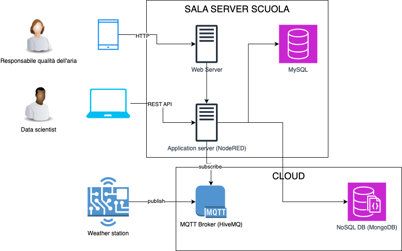

# Scenario

Una scuola vuole monitorare la qualità dell'aria per attuare eventuali azioni di riduzione dell'inquinamento.

## Utenti e dimensionamento

Individuiamo i seguenti utenti del servizio:

- Responsabili qualità dell'aria (personale della scuola, docenti o ATA): circa 6
- Data scientists (docenti e studenti): circa 3

Ipotizziamo inoltre che le stazioni di monitoraggio all'interno della scuola saranno circa 6.

## Dispositivi e casi d'uso

Individuiamo i seguenti dispositivi e casi d'uso:

- i responsabili qualità dell'aria useranno principalmente uno smartphone con una pagina web per la visualizzazione dei dati, collegati ad internet tramite Wi-Fi, della scuola o personale
- i data scientists useranno un computer fisso con delle applicazioni locali (es. programma in Python), possono collegarsi sia dai computer di scuola che di casa

Per quanto riguarda la stazione di monitoraggio, ipotizziamo l'uso di una scheda ESP32 connessa direttamente con i sensori per il monitoraggio ambientale e alla rete scolastica tramite Wi-Fi. Come estensione futura, possiamo pensare ad una connessione LoraWAN, a maggior raggio e minori consumi.

## Architettura di rete

- WebServer
- Application Server (Node-RED)
- DB SQL (MySQL)
- DB NoSQL (MongoDB) 

La scuola ha già a disposizione un web server, un server Node-RED ed un DBMS con MySql, quindi si decide di usare l'infrastuttura già esistente per ridurre i costi.

Per il DB NoSQL invece, non ancora presente a scuola, si decide per il momento di usare un servizio in cloud, in modo da poter testare a basso costo o gratuitamente il servizio per poi valutare se importarlo all'interno dei server della scuola.

## Note sul tutorial

In questo tutorial, per comodità useremo tutti servizi in cloud anche per quelli on-premises.

In particolare, come application server useremo Node-RED su una macchina AWS-EC2 con Ubuntu. In ogni caso è facilmente replicabile on-premises seguendo le stesse istruzioni ma con una macchina Ubuntu locale.
