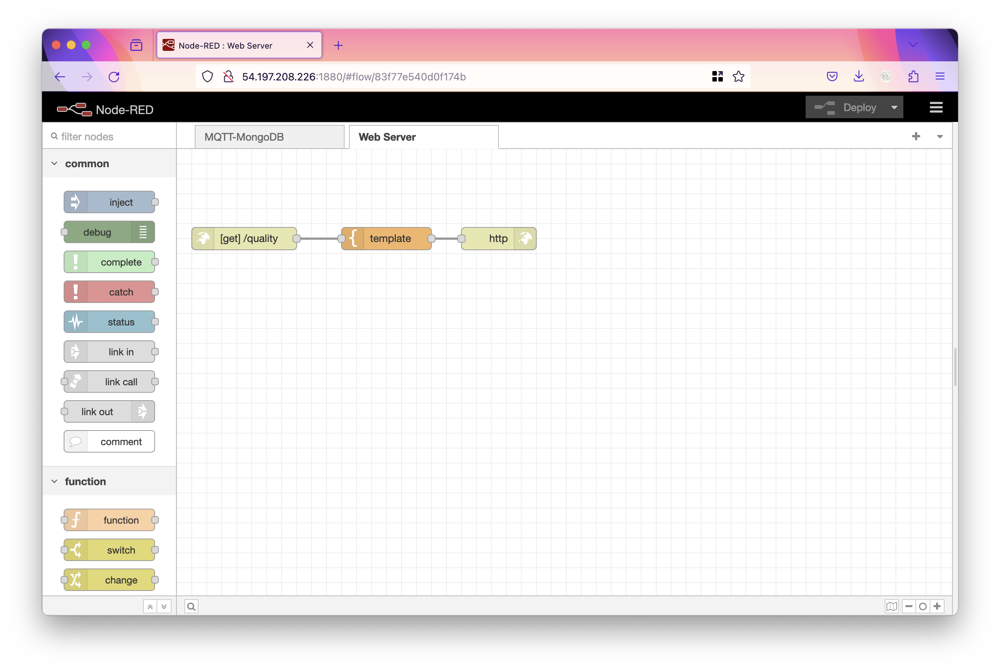
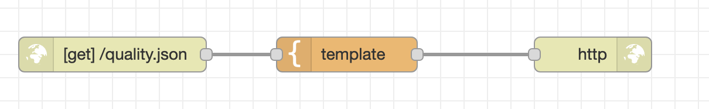
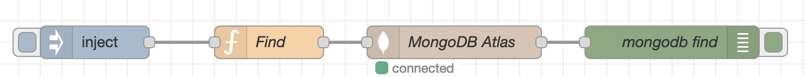
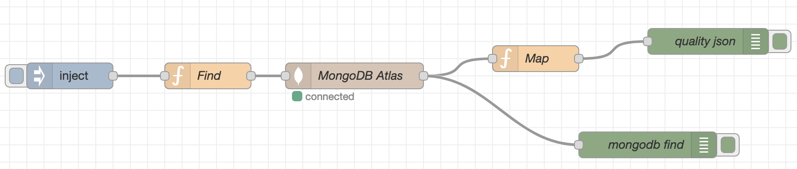
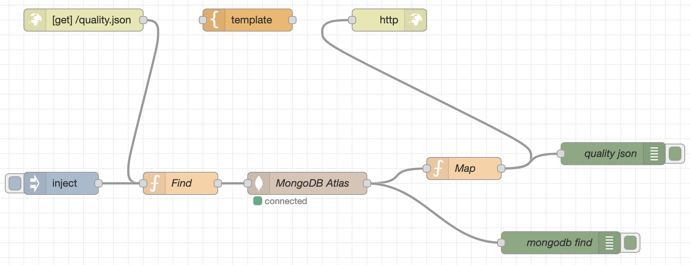

# Web-API

A questo punto siamo pronti per completare il nostro servizio connettendo la pagina web a Node-RED.

Creiamo un nuovo flow che chiamiamo "Web Server" e mettiamo i seguenti nodi:



Nel primo nodo (HTTP in), impostiamo come URL "quality".

Nel secondo nodo, il template, copiamo incolliamo il codice da codepen, aggiungendo il tag `<style>` dentro l'head ed il tag `<script>` subito prima della fine del body, il risultato sarà qualcosa del genere.

```html
<!DOCTYPE html>
<html>
    <head>
        <title>Qualità aria</title>
        <style>
body {
  margin: 0;
}

nav {
  background-color: #2b57b6;
  color: white;
  padding: 0.3rem;
}

#sensor-list {
  display: flex;
  flex-direction: column;
  background-color: #f5f1ed;
}

.sensor {
  display: flex;
  flex-direction: row;
  flex-grow: 1;
}

.sensor > div {
  flex-grow: 1;
  flex-basis: 0px;
}

.good {
  background-color: orange;
}

.bad {
  background-color: red;
}

.optimal {
  background-color: green;
}

.good::after {
  content: "Buona";
}

.bad::after {
  content: "Scadente";
}

.optimal::after {
  content: "Ottima";
}

        </style>
    </head>
    <body>
        <nav>Marconi qualità aria</nav>

<div id="sensor-list">

</div>
<script>

fetch("/quality.json")
  .then((response)=>response.json())
  .then((json)=> {
  console.log(json);
  let sensorList = document.getElementById("sensor-list");
  json.forEach((sensor) => {
    sensorList.innerHTML += `<div class="sensor" data-id="${sensor.id}">
    <div class="sensor-location">${sensor.location}</div>
    <div class="sensor-quality ${sensor.quality}"></div>
  </div>`;
  });
});

</script>
    </body>
</html>
```

Attenzione: abbiamo cambiato l'URL della fetch per prendere un JSON in locale, prima di poter verificare che la pagina funzioni dobbiamo aggiungere questo URL, che in termine tecnico viene anche detto "endpoint"

## Data endpoint

Creiamo un nuovo flow e chiamiamolo "Endpoint". Qui metteremo i dati letti dal database MongoDB. Prima però di fare la connessione al DB, creiamo un endpoint statico di test per verificare che tutto funzioni.

### Endpoint statico (di test)

Aggiungiamo nuovamente i tre nodi "html in", "template" e "html response". Facciamo le seguenti modifiche:

- in "html in", inserire come URL `/quality.json`
- in "template", modificare il "Syntax Highlight" e selezionare "JSON"
- copiare il json che abbiamo già usato [qui](./web.html#rendere-la-pagina-dinamica) e inserirlo nella casella di testo
- modificare "Output as" e selezionare "Parsed JSON"



A questo punto possiamo provare se la pagina funziona andando alla pagina `http://<nodered-ip>:1880/quality`

### Endpoint reale

#### Richiesta al database

Per fare la richiesta al DB, usiamo la sequenza di nodi "inject" -> "function" -> "mongodb in" -> "Debug", con le seguenti configurazioni:

- in inject, cancelliamo tutti i campi (payload e topic)
- in function, diamo il nome "Find" ed inseriamo il seguente codice:

```js
msg.payload = {"timestamp": {"$exists": true}}
msg.sort = {
  timestamp: -1
}
msg.limit = 10;

return msg;
```

In questo modo troviamo solo i record che hanno un timestamp, li ordiniamo dal più recente e limitiamo la ricerca a 10

- in mongodb in, selezionare il server che avevamo già creato precedentemente, come collezione inserire "sensori", come operazione "find" e come nome "MongoDB Atlas"
- in debug, cambiamo nome e lo chiamiamo "mongodb find"



A questo punto, premendo il pulsante sul lato sinistro del blocco inject possiamo avviare il flusso e controllare che compaia la stampa di debug con i risultati del database.

#### Calcolo della qualità dell'aria

La chiamata al database ritorna i valori misurati dai sensori, ma a noi serve la qualità dell'aria: dobbiamo quindi scrivere una funzione di mappatura.

Questo è il primo momento del progetto in cui affrontiamo la _business logic_: finora abbiamo fatto solo connessioni tra elementi, mentre ora dobbiamo mettere _dell'intelligenza_ all'interno del nostro codice.

In particolare, il problema che stiamo affrontando si chiama di _classificazione_, in quanto dobbiamo assegnare delle "classi" ad un insieme di valori di input. Per questo genere di problemi, il _machine learning_ è particolarmente potente, perché permette di risolvere problemi anche molto complessi in modo relativamente semplice ed efficiente. Nel nostro caso però dobbiamo usare un metodo più semplice, ed useremo quindi un approccio basato su _soglie_.

Anche in una situazione semplificata come questa però, è buona norma affidarsi a dei documenti ufficiali che diano un valore alla nostra logica. Dalla letteratura disponibile su Internet [fonte?], possiamo considerare una situazione ottimale tra i 19&deg;C ed i 26&deg;C gradi, con una umidità tra il 40% ed il 60%. Possiamo allargare un po' questi intervalli per la situazione buona, tutto il resto è cattiva qualità.

Aggiungiamo quindi un nodo funzione ed un blocco di debug.



Nella funzione possiamo mettere il seguente codice.

```js
// Map array
let locations = [];
let result = [];
msg.payload.forEach((element) => {
    // Se il luogo è già stato aggiunto, non aggiungerlo di nuovo
    if (locations.includes(element.location)) {
        return;
    }
    locations.push(element.location);
    
    // Convertire i valori dei sensori in qualità dell'aria
    let quality = "";
    if ((element.temp > 19) && (element.temp < 26)
        && (element.humidity > 40) &&(element.humidity < 60)){
        quality = "optimal";
    } else if ((element.temp > 16) && (element.temp < 29)
        && (element.humidity > 30) &&(element.humidity < 70)){
        quality = "good";
    } else {
        quality = "bad";
    }
    
    // Creare l'oggetto di uscita
    let data = {
        id: element._id,
        location: element.location,
        quality: quality,
        
    }
    // Aggiungerlo all'array di uscita
    result.push(data);
});

msg.payload = result;
console.log(msg.payload);
return msg;
```

Se il JSON in debug di questo nodo coincide nel formato con quello di test che abbiamo usato nel nodo template, possiamo collegare i nodi di richiesta e risposta e concludere così il progetto.

