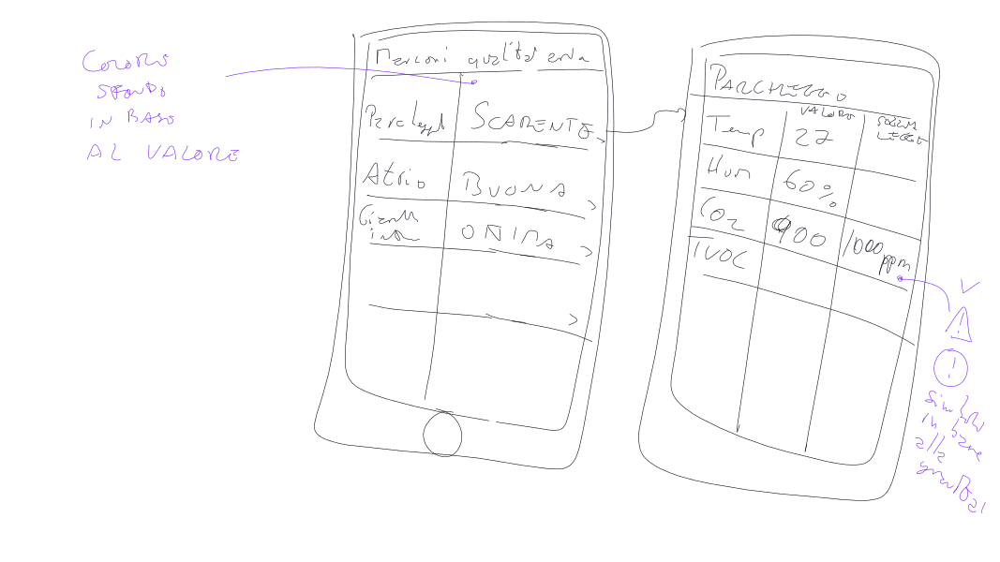
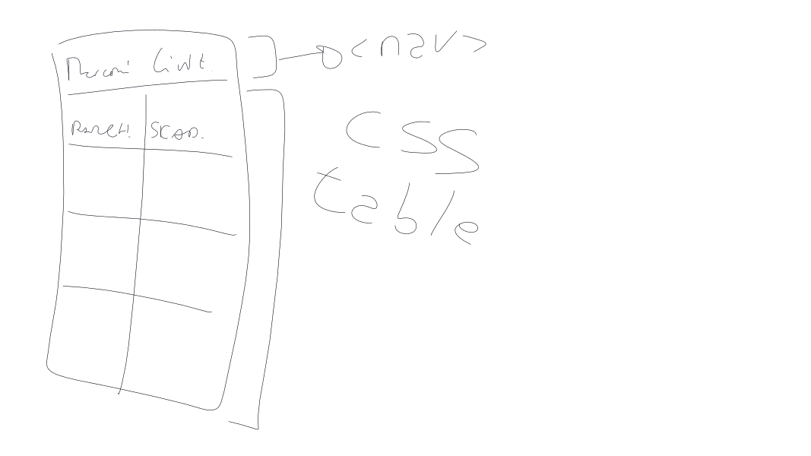
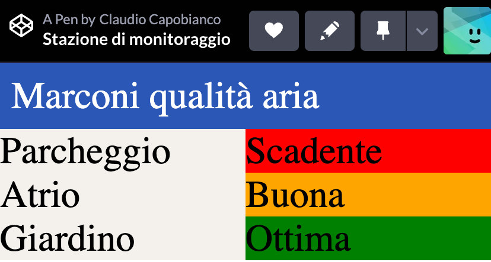

# Pagina web

La progettazione della pagina web, in un approccio _User Centered Design_, parte dall'utente. Creiamo quindi una "Persona" (plur. Personas) che dovrà usare l'app. Cominciamo dal responsabile della qualità dell'aria.

## Persona

```
Nome: Maria De Baselli
Vive e lavora a: Civitavecchia
Impiego: docente (vicepreside)
Maria vuole controllare la qualità dell'aria per assicurarsi che non superi le soglie consentite dalla legge.
```

## Wireframe

Dopo aver definito la persona, passiamo all'implementazione del wireframe. Ricordiamo che nel wireframe dobbiamo immaginarci come se dovessimo fare uno "screenshot" in bianco e nero delle pagine che ci interessano, così come appariranno all'utente finale. In altre parole, il testo e la disposizione degli elementi deve essere il più verosimile possibile. Per quanto riguarda i colori, si possono specificare a margine solo se questi hanno un significato importante dal punto di vista dell'esperienza utente. Ad esempio nel nostro caso è importante specificare che il colore dello sfondo di alcune celle deve essere in accordo con la qualità dell'aria a cui si riferisce.



A questo punto possiamo "tagliare" la pagina in elementi HTML per poi passare alla fase di implementazione. Nel nostro caso, decidiamo di fare la tabella usando regole CSS anziché il tag `<table>`, in modo che possa essere più facilmente reso responsive ed adattabile agli schermi di diversi dispositivi.



In particolare per la tabella decidiamo di usare la proprietà `display:flex`, in modo da poter disporre in futuro le informazioni non necessariamente in forma tabellare ma anche in altro modo, ad esempio come _cards_.

## Implementazione della pagina

Per prima cosa implementiamo il codice **HTML** con la struttura della pagina.

```html
<nav>Marconi qualità aria</nav>

<div id="sensor-list">
  <div class="sensor" data-id="1">
    <div class="sensor-location">Parcheggio</div>
    <div class="sensor-quality bad">Scadente</div>
  </div>
  <div class="sensor" data-id="2">
    <div class="sensor-location">Atrio</div>
    <div class="sensor-quality good">Buona</div>
  </div>
  <div class="sensor" data-id="3">
    <div class="sensor-location">Giardino</div>
    <div class="sensor-quality optimal">Ottima</div>
  </div>
</div>
```

Note sull'HTML:

- `data-id` è un attributo che serve per identificare non in maniera univoca un elemento HTML nella pagina, ma un dato specifico all'interno di una lista di dati. Questo valore poi verrà assegnato alla chiave primaria del dato, in modo da poterlo manipolare successivamente (es. per aggiornarlo o cancellarlo)

Ora passiamo alla parte **CSS**:

```css
body {
  margin: 0;
}

nav {
  background-color: #2b57b6;
  color: white;
  padding: 0.3rem;
}

#sensor-list {
  display: flex;
  flex-direction: column;
  background-color: #f5f1ed;
}

.sensor {
  display: flex;
  flex-direction: row;
  flex-grow: 1;
}

.sensor > div {
  flex-grow: 1;
  flex-basis: 0px;
}

.good {
  background-color: orange;
}

.bad {
  background-color: red;
}

.optimal {
  background-color: green;
}
```

Note sul CSS:

- abbiamo implementato in questo caso due display flex annidati: uno per la lista sensori, una per gli elementi di ogni sensore; anche una soluzione con display grid sarebbe stata accettabile
- `flex-grow: 1; flex-basis: 0px;` serve per fare in modo che tutte le celle abbiano la stessa larghezza e che non si adattino al contenuto (comportamento di default)

Ora abbiamo la nostra pagina che ha l'aspetto che desideriamo. È largamente migliorabile ma comunque per ora accettabile.



### Rendere la pagina dinamica

La pagina finora è statica, dobbiamo renderla dinamica.

Per renderci indipendenti dal sistema reale di generazione dati, che potrebbe essere momentaneamente non disponibile o avere altri problemi, creiamo per ora dei dati "mockup" che siano sempre disponibili e costanti. Useremo GitHub Gist per questa operazione.

Andiamo su [gist.github.com](gist.github.com) e creiamo un public gist, lo nominiamo `quality.json` e scriviamo il seguente esempio di dati:

```json
[
  { "location":"Parcheggio","quality":"bad","id":1},
  { "location":"Atrio","quality":"good","id":2},
  { "location":"Giardino","quality":"optimal","id":3}
]
```

A questo punto possiamo scrivere la parte JS che prende questo dato e crea dinamicamente gli elementi.

```js

fetch("https://gist.githubusercontent.com/<username>/<hash>/quality.json")
  .then((response)=>response.json())
  .then((json)=> {
  console.log(json);
  let sensorList = document.getElementById("sensor-list");
  json.forEach((sensor) => {
    sensorList.innerHTML += `<div class="sensor" data-id="${sensor.id}">
    <div class="sensor-location">${sensor.location}</div>
    <div class="sensor-quality ${sensor.quality}"></div>
  </div>`;
  });
});
```

Note sul JS:

- il link esatto al vostro gist lo potete ottenere premendo su "Raw" e quindi copiando il link a questa pagina; deve avere una struttura simile a quella dell'esempio
- la funzione `fetch()` fa una chiamata HTTP GET e quando è completa esegue la funzione passata come argomento a `.then()`
- il primo `then()` estrae il JSON dalla response (che di base è una stringa semplice) e chiama la `then()` successiva
- visto che il JSON non contiene le stringhe "Buona", "Scadente", etc., in quanto dipendono dalla lingua del browser, le aggiungiamo con le seguenti regole CSS, da aggiungere alla fine:

```css
.good::after {
  content: "Buona";
}

.bad::after {
  content: "Scadente";
}

.optimal::after {
  content: "Ottima";
}
```

Ricordiamoci di commentare nell'HTML la parte che è stata resa dinamica, che non ci serve più.

[Qui](https://codepen.io/Claudio-Capobianco/pen/GRLBJmZ?editors=1000) il link alla versione finale.
